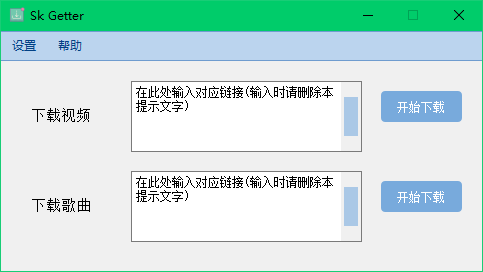

# Sk Getter

#### 软件介绍
功能: 下载部分平台的视频,音乐(没错, 就是这么简洁@^_^@)
至于软件名, Sk取自作者英文名Skyler, Getter应该都知道吧
因为想更注重实用性, 界面就写得很简洁

#### 安装教程

1.  [点击我下载最新版](https://gitee.com/skyler-sun/sk-getter/releases/download/v0.0.3/SkGetter_v003.7z)
2. [所有版本下载（蓝奏云链接）](https://skyler.lanzouo.com/b03pox9sd)提取密码:57m7
3. 下载完成并解压后, 双击main.exe即可打开
4. **切记第一次运行先设置保存路径!!!**
5. 软件第一次打开可能会遇到自动退出的现象,多试几次就好了

#### 使用须知

1.  本软件仅供学习研究及日常使用
2.  软件关闭后出现的"main.exe已停止工作"是正常情况,请忽略
3. 对于下载视频功能, Bilibili除大会员视频外大部分都能下载
4. 下载安装使用本软件就代表用户仔细阅读并同意[软件协议MIT License](https://gitee.com/skyler-sun/sk-getter/blob/master/LICENSE)

对于**网易云音乐**黑胶和非黑胶歌曲下载, 链接获取方式如下

#### 软件实现原理
采用正则表达式匹配链接,requests构造请求头并下载文件
使用开源ffmpeg合并视频和音频

本软件使用的第三方库如下
cloudmusic 0.1.0
pyquery   1.4.3
requests  2.28.1
PyQt      5.15.4
使用pyqt desinger对窗口进行设计

[style.qss样式来源](https://www.programmerall.com/article/26091298015/)