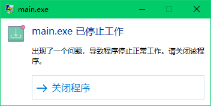
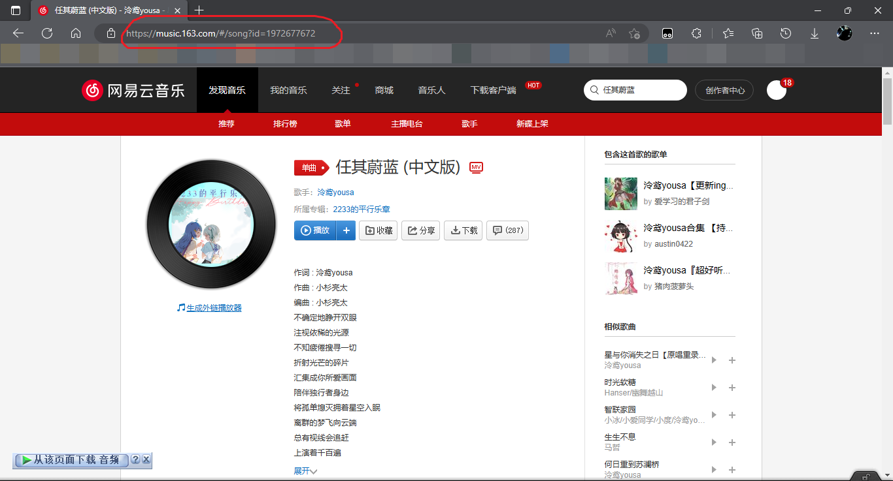
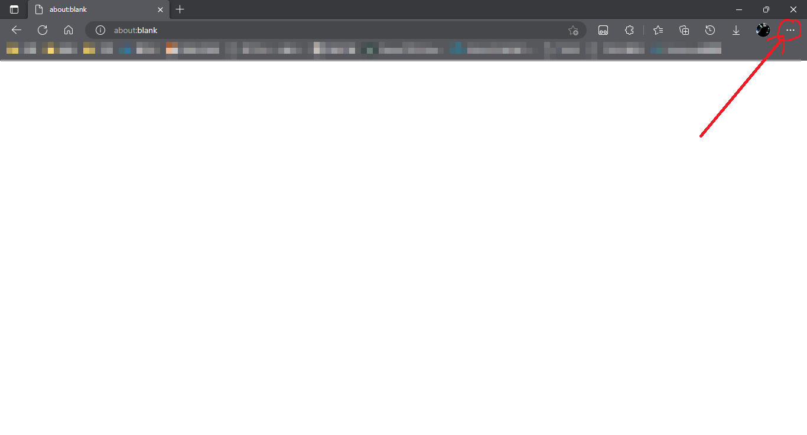
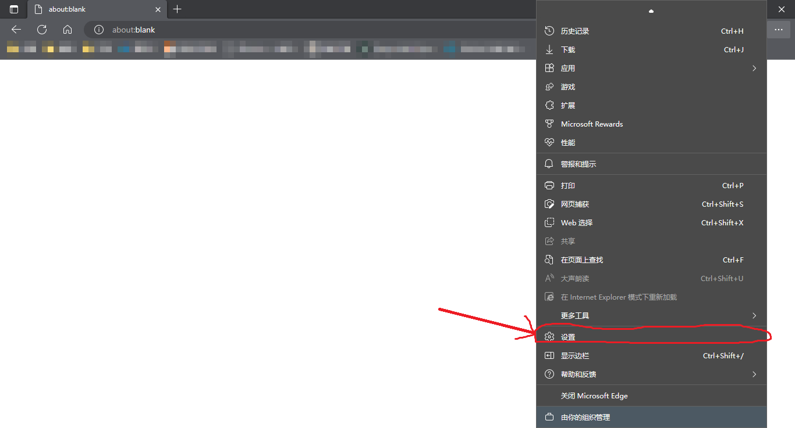
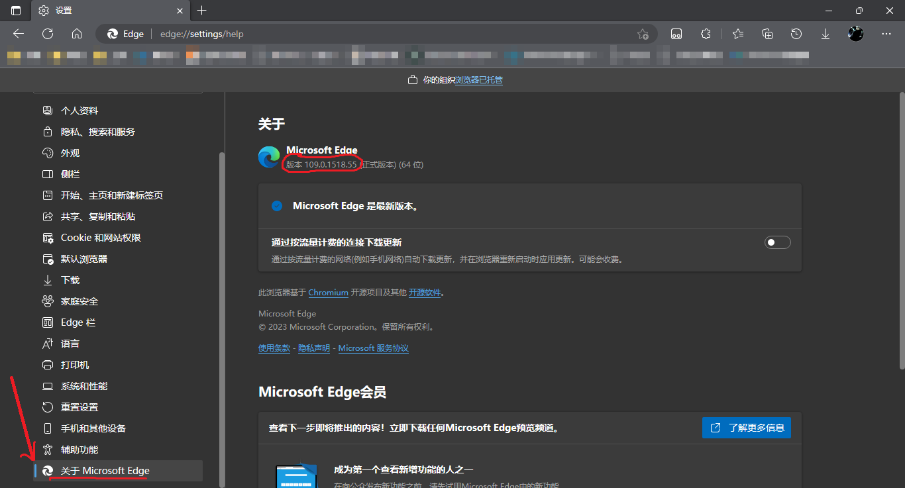
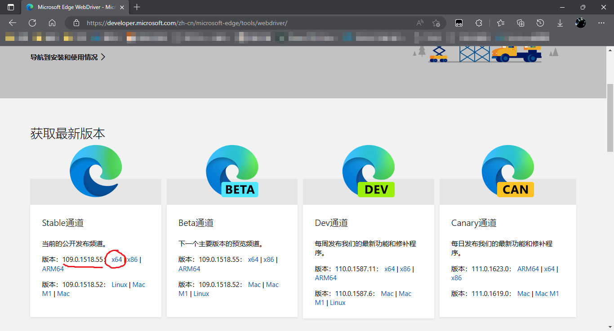
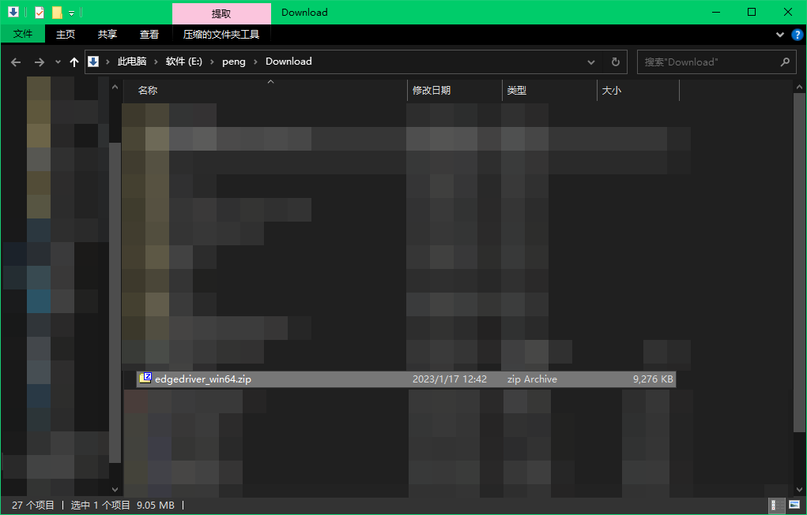
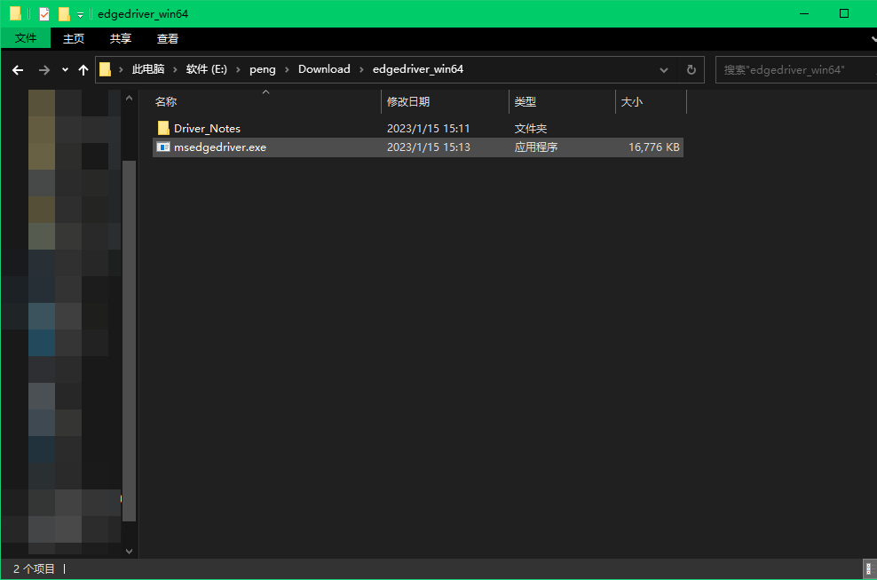
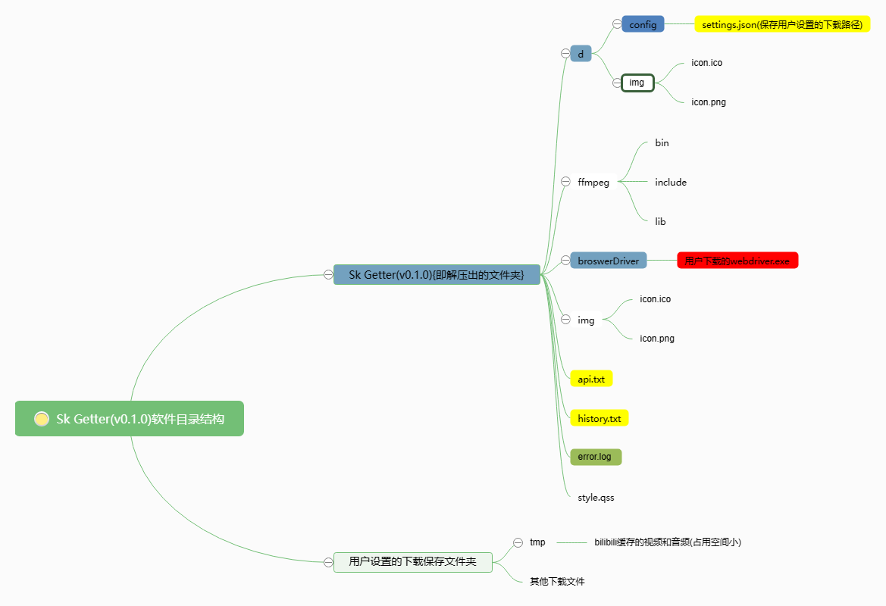
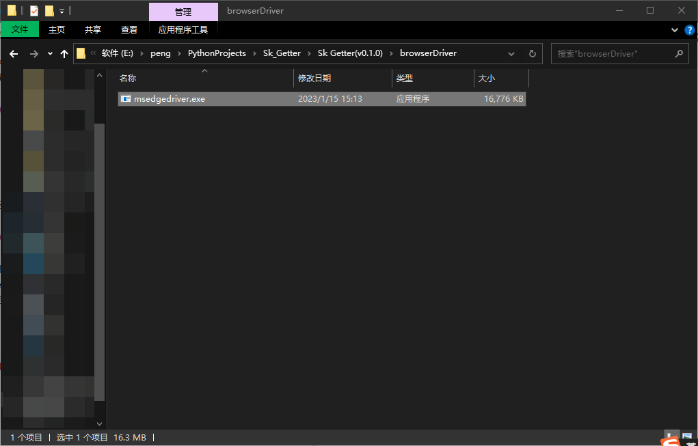

# Sk Getter

## 软件介绍
功能: 下载部分平台的视频,音乐(没错, 就是这么简洁@^_^@)
至于软件名, Sk取自作者英文名Skyler, Getter应该都知道吧
因为想更注重实用性, 界面就写得很简洁

[Gitee仓库链接](https://gitee.com/skyler-sun/Sk-Getter/)
[Github仓库链接](https://github.com/Skyler-std/Sk-Getter/)

## 安装教程

1. [点我下载最新版](https://github.com/Skyler-std/Sk-Getter/releases/download/v1.0.0/Sk.Getter.v1.0.0.7z)
2. [所有版本下载（蓝奏云链接）](https://skyler.lanzouo.com/b03pox9sd)提取密码:57m7
3. 下载完成并解压后, 双击main.exe或Sk Getter(vX.X.X).exe即可打开
4. **切记第一次运行先设置保存路径!!!**

## 使用说明

1. 软件关闭后出现的"main.exe已停止工作"是**正常情况**,请忽略
2. ~~下载过程中出现的黑色窗口是webdriver运行界面，请勿关闭~~（v1.0.0已不予以显示）
3. 对于下载视频功能, Bilibili除大会员视频外大部分都能下载
4. 下载安装使用本软件就代表用户仔细阅读并同意[软件协议MIT License](https://gitee.com/skyler-sun/sk-getter/blob/master/LICENSE)
5. 使用腾讯视频下载功能时因流量较大，download.exe内存占用为200-450M,网络占用大约为9M/s(代理截留和视频下载加在一起)（2023/01/23 作者的话： v1.0.0版本好像有所改善）
6. 芒果tv因链接较多，为节约计算机资源，使用多线程异步技术，下载时间可能较长，请合理分配时间，**芒果tv视频文件是以下载的时间命名的，例如：20230123.mp4，下载完成后请删除.ts文件，以免造成空间浪费**
7. 软件可能因为运行了外部应用程序吧，一些杀毒软件可能会误报，请将软件添加至信任名单（注意保持软件完整性）

------------

对于**网易云音乐**黑胶和非黑胶歌曲下载, 链接获取方式如下（tips:所有视频歌曲类链接方法均类似）

------------

### 腾讯视频，芒果tv等下载及bilibili高清画质下载功能
##### 自动配置webdriver(目前仅限edge浏览器)
1. 打开软件
2. 依次点击"设置"=>"全局设置"
3. 点击“自动配置webdriver”

##### 手动配置webdriver
1. **确定浏览器**
**Microsoft Edge**, **Firefox**, **Chrome**之中的任意一个(若没有,请自行安装), 推荐Microsoft Edge. ~~其他浏览器没测试过>_<~~
2. **确定浏览器版本**, 下面给出**Microsoft Edge**的确定方法 (其他浏览器类似)

打开浏览器

打开设置

点击**关于Microsoft Edge**并记住**浏览器版本**(tips:可以写下来或记在电脑上)

到这里你已经成功了一半了@^_^@接下来是下载webdriver[点这里打开下载页面](https://developer.microsoft.com/zh-cn/microsoft-edge/tools/webdriver/ "是")
例如我的浏览器版本是**109.0.1518.55**系统为**64位**,就点这个(一般系统都是64位)

下载完成后是这个样子滴

因为是zip文件,就把他解压出来,然后是这样

Driver_Notes文件夹是文档说明,可以直接删掉
重要的是**msedgedriver.exe**文件,我们鼠标右键复制它
然后根据下面这张**软件目录结构思维导图**找到**browserDriver**文件夹

(v1.0.0新增:ffmpeg目录移动至d文件夹下)
粘贴到里面就可以了
注意下载下来的文件**不要**改成上图的webdriver.exe,保留原文件名就好
成功后是这个样子

#### 到这里就算安装配置完成了,祝贺祝贺!@^_^@!

关于这个功能你需要了解的事情
- 暂不支持批量下载, 请一个一个来
- 有的视频可能等很久都没反应, 请关闭软件后重试几次
- 开始下载后出现的黑色窗口显示的是webdriver启动的浏览器的日志,最小化该窗口即可[**切记不要关闭该窗口,否则会导致下载失败**]

------------

## 软件实现原理
采用正则表达式匹配链接,requests构造请求头并下载文件
使用开源ffmpeg合并视频和音频
对于腾讯视频的获取,接口来源如下(xxx为填充的腾讯视频链接)
https://jx.jsonplayer.com/player/?url=xxx

本软件使用的第三方库如下

cloudmusic 0.1.0

pyquery   1.4.3

requests  2.28.1

PyQt      5.15.4

selenium

seleniumwire

使用pyqt desinger软件对窗体进行设计

[style.qss样式来源](https://www.programmerall.com/article/26091298015/)

## 联系作者
邮箱:3385213313@qq.com

注：因软件问题联系作者时请说明具体情况和信息，如果有截图和录屏就更好
